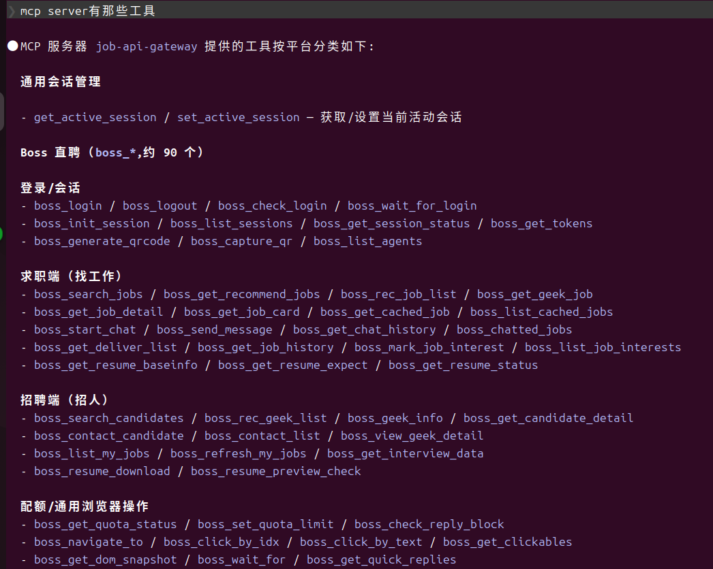
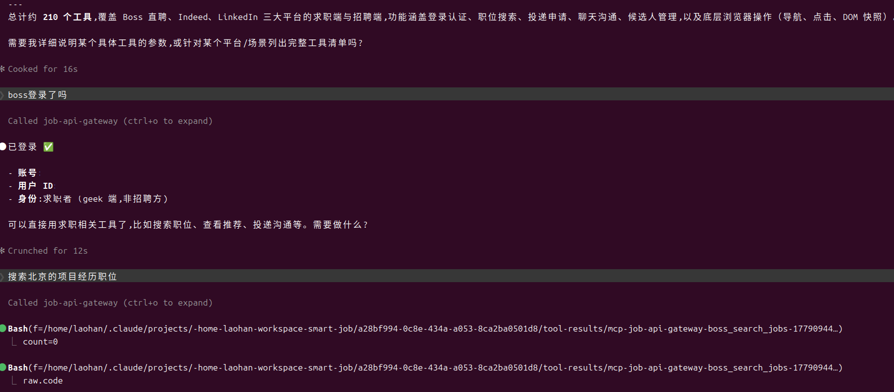
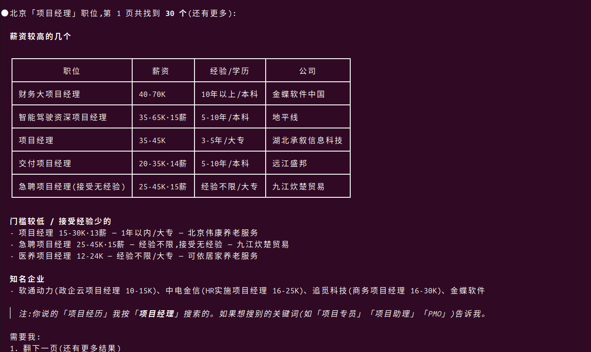
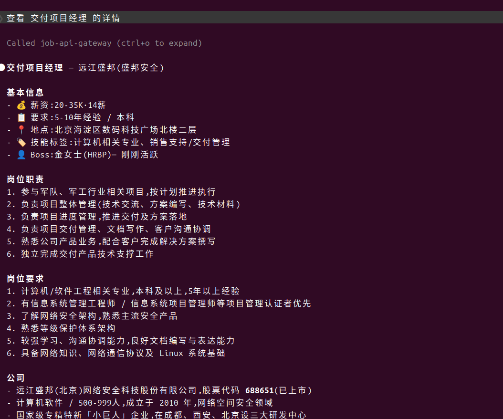
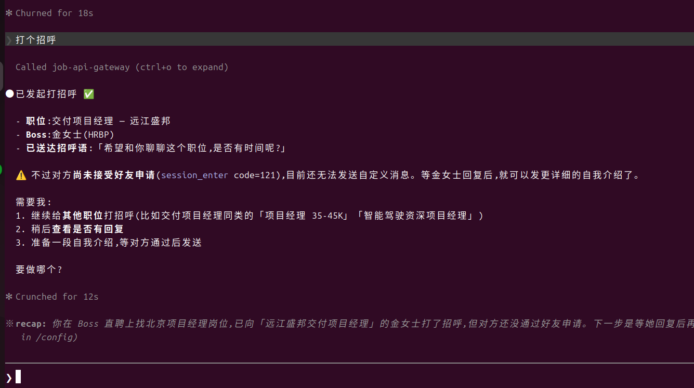

# 扩展加载与首次使用

> 本文一步步引导你把 SmartJob 浏览器扩展加载进 Chrome、连上后端、完成登录与引导。
> 扩展的内部设计见 [EXTENSION.md](EXTENSION.md);后端如何启动见根目录
> [README.md](../README.md)。

## 1. 前置条件

- 一个支持 Manifest V3 与侧边栏的浏览器:Chrome / Chromium / Edge(较新版本)。
- **后端已启动**。推荐用 Docker 一键拉起(见 [README.md](../README.md))。启动后三个
  后端服务监听:

  | 服务 | 地址 |
  |---|---|
  | portal-api(账号 / 鉴权) | `http://127.0.0.1:8771` |
  | api-gateway(命令网关) | `http://127.0.0.1:8767` |
  | agent-gateway(Agent 对话) | `http://127.0.0.1:8769` |

## 2. 加载扩展到浏览器

扩展是未打包的源码目录,以「开发者模式」加载:

1. 地址栏打开 `chrome://extensions`。
2. 打开右上角的 **开发者模式**。
3. 点 **加载已解压的扩展程序**。
4. 选择仓库里的 `extensions/job-seeker/` 目录。
5. 扩展出现在列表中(名称 **SmartJob**,版本 0.8)。建议点工具栏的拼图图标把它
   **固定** 到工具栏,方便随时打开。

> 改动了扩展代码后,回到 `chrome://extensions` 点该扩展卡片上的 **刷新** 按钮即可
> 重新加载。

## 3. 打开侧边栏

点工具栏的 SmartJob 图标 → 侧边栏在浏览器右侧打开。**首屏即「登录 / 注册」表单。**

## 4. 配置后端网关地址(关键一步)

登录前必须先把扩展指向你的后端 —— 网关地址配错会直接导致登录失败。

1. 点侧边栏顶部的 **⚙️ 设置**(未登录时在登录向导的左上角;登录后在主顶栏)。
2. 设置页有三个地址输入框,分别对应三个后端服务。
3. 本地 Docker 环境:点 **「开发环境」预设**,一键填入:

   | 字段 | 值 |
   |---|---|
   | portal-api | `http://127.0.0.1:8771` |
   | api-gateway | `http://127.0.0.1:8767` |
   | agent-gateway | `http://127.0.0.1:8769` |

4. 点 **保存**。可用页面上的 **连通测试** 确认三个地址都可达。

> 若后端部署在远程服务器,把三个地址换成对应的公网地址即可(可用「自定义」)。

## 5. 登录 / 注册

回到侧边栏首屏的登录 / 注册表单:

- **已有账号** —— 在「登录」页输入邮箱 + 密码。
- **新账号** —— 切到「注册」页,填邮箱 + 密码 → 收邮箱验证码 → 输入验证码完成注册。
- **本地 Docker 自带测试账号** —— 开发模式(`APP_ENV=development`)下 portal-api 会
  自动播种一个默认账号,可直接登录:

  ```
  邮箱:  demo@smartjob.top
  密码:  123456
  ```

  这是弱口令测试账号,**生产环境务必关闭播种**(`APP_ENV=production`,详见
  [BACKEND.md](BACKEND.md))。

## 6. 完成首次引导

登录成功后,扩展会依次引导你:

1. **选择身份** —— 求职者 / 招聘者。
2. **选择平台** —— BOSS直聘 / LinkedIn / Indeed。
3. **登录该平台** —— 按提示在平台站点完成登录(扩展只在你自己的登录态下操作)。
4. **(求职者)完善背景** —— 上传简历 → AI 解析 → 确认求职偏好。

引导走完后即进入 AI 助手对话界面,可以开始用自然语言下达求职 / 招聘任务。

## 7. 验证连接是否成功

- 扩展连上 api-gateway 后,会通过 WebSocket 建立一个会话。
- 打开管理后台(`http://localhost:8081`)的 **仪表盘 / 浏览器池**,应能看到该扩展
  会话;api-gateway 的 `GET /status` 返回里 `extensions_connected` 会 +1。

## 8. 在 Claude Code 中使用(MCP)

除侧边栏的 AI 助手外,还可以让 [Claude Code](https://claude.com/claude-code) 直接驱动扩展
—— api-gateway 本身是一个 MCP server,Claude Code 连上后即可调用 `boss_* / linkedin_* /
indeed_*` 等平台自动化工具。链路:`Claude Code → api-gateway → 扩展 → 浏览器`。

仓库根目录已带项目级 MCP 配置 `.mcp.json`:

```json
{
  "mcpServers": {
    "smartjob": {
      "type": "http",
      "url": "http://127.0.0.1:8767/mcp",
      "headers": { "x-user-id": "smartjob", "x-user-role": "jobseeker" }
    }
  }
}
```

使用步骤:

1. 后端已启动,且扩展已按上文连上 api-gateway。
2. 扩展登录默认账号 **`demo@smartjob.top`** —— 它的用户 id 是固定常量 `smartjob`,必须与
   `.mcp.json` 里的 `x-user-id` 一致,Claude Code 调的工具才能路由到你这个扩展。
3. 在仓库目录里打开 Claude Code,首次会提示是否信任本项目的 MCP server,确认即可。
4. `claude mcp list` 应显示 `smartjob ✓ Connected`。
5. 直接对 Claude 说「检查一下 Boss 直聘登录状态」之类,它会自动调用对应工具。

配置好后,在 Claude Code 里的实际效果 —— 从列工具到搜索、看详情、打招呼:

**① 列出 MCP 工具** —— 问「mcp server 有哪些工具」,Claude Code 列出 job-api-gateway 暴露的
全部工具(约 210 个,覆盖 Boss 直聘 / LinkedIn / Indeed 三大平台的求职端与招聘端)。



**② 检查登录、发起职位搜索** —— 「boss 登录了吗」→ Claude 调 `boss_check_login`;
「搜索北京的项目经理职位」→ 调 `boss_search_jobs`。



**③ 拿到搜索结果** —— Claude 把职位整理成清单(职位 / 薪资 / 经验 / 公司),并给出分类与建议。



**④ 查看职位详情** —— 「看下交付项目经理的详情」→ 调 `boss_get_job_detail`,返回岗位职责、
要求与公司信息。



**⑤ 打招呼联系 HR** —— 「打个招呼」→ 调 `boss_start_chat`,在你的浏览器里向对方 HR 发起打招呼。



> 不在仓库目录、或想让所有项目都能用,可改用用户级配置(与 `.mcp.json` 二选一,不要
> 同时配,否则会出现两个重复的 MCP server):
>
> ```bash
> claude mcp add --transport http smartjob http://127.0.0.1:8767/mcp \
>   --header "x-user-id: smartjob" --header "x-user-role: jobseeker"
> ```

后端部署到公网时,把 `.mcp.json` 里的 URL 换成对应的 api-gateway 公网地址即可。

## 9. 常见问题

| 现象 | 排查 |
|---|---|
| 登录一直转圈 / 失败 | 多半是网关地址不对 —— 顶部 **⚙️ 设置** 重新配置并做连通测试 |
| 侧边栏打不开 | 确认浏览器版本支持 `sidePanel`;点工具栏的扩展图标触发 |
| 改了扩展代码不生效 | `chrome://extensions` 里点该扩展的 **刷新** 按钮 |
| 平台操作被风控(验证码 / 登录失效) | 扩展与 Agent 会给出提示,按指引到平台站点处理后继续 |
| 管理后台看不到扩展会话 | 确认 api-gateway 地址正确、已登录;查看 api-gateway 容器日志 |
