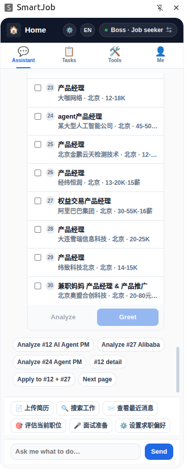
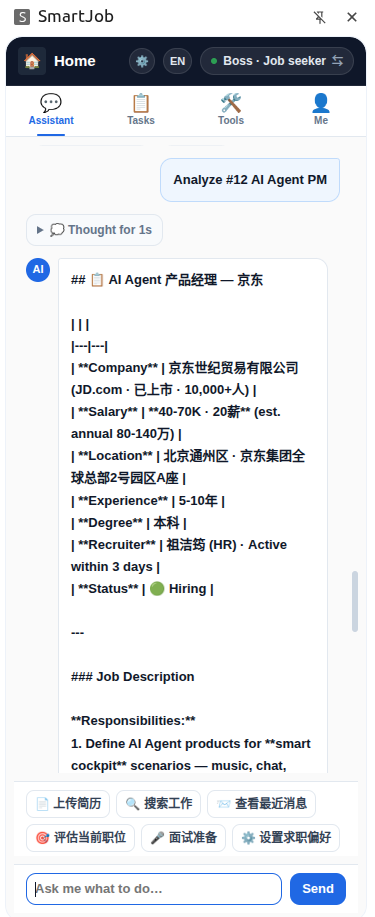
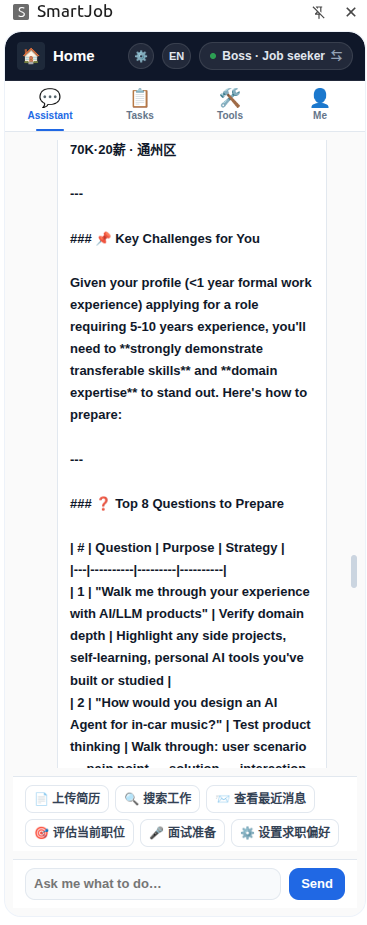
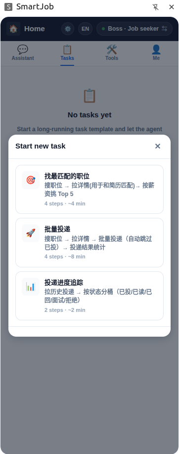
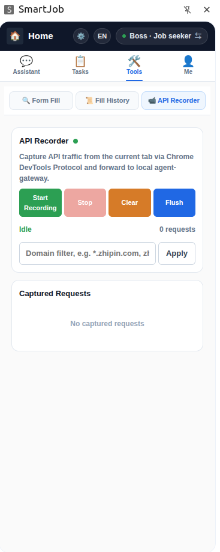

# 扩展设计

> `extensions/job-seeker/` 是一个 Chrome Manifest V3 扩展（原生 JS，无构建步骤）。
> 它是整个系统里**唯一直接接触求职平台的组件** —— 所有平台请求都在用户浏览器内、
> 用户登录态下发出。扩展同时服务求职者与招聘者，并提供抓包、自动填表、工作自动化
> 三大能力。总体定位见 [ARCHITECTURE.md](ARCHITECTURE.md)。

## 1. 整体结构

```
extensions/job-seeker/
├── manifest.json        MV3 声明：权限、内容脚本、Service Worker、侧边栏
├── background/          Service Worker —— 控制面
│   └── index.js         主入口：WebSocket 连接、命令分发
├── content/             内容脚本 —— 注入到平台页面
│   ├── shared/          跨平台：世界桥接、反检测、页面信息提取、注入式 UI
│   ├── boss/            BOSS直聘 专用钩子
│   ├── linkedin/        LinkedIn 专用钩子
│   ├── indeed/          Indeed 专用钩子
│   └── autofill/        自动填表的字段探测与填充原语
├── lib/
│   ├── ext-core/        核心自动化引擎（命令、令牌链、动态命令、站点执行器）
│   ├── recorder/        抓包子系统
│   ├── autofill/        自动填表子系统
│   └── i18n/            双语引擎
├── sidepanel/           侧边栏 UI —— 主界面
├── popup/               工具栏弹窗 —— 快捷状态
├── options/             设置页 —— 后端地址等配置
└── _locales/            Chrome 标准 i18n 文案
```

### 1.1 MV3 关键声明

- **Service Worker**：`background/index.js`，控制面，空闲会被回收（设计上无状态、可恢复）。
- **侧边栏（Side Panel）**：`sidepanel/index.html`，常驻主界面。
- **内容脚本**：对每个平台注入两套脚本 ——
  - **MAIN world，`document_start`**：在页面 JS 之前运行，做请求拦截准备。
  - **ISOLATED world，`document_idle`**：DOM 就绪后运行，经 `postMessage`
    与 MAIN world 通信，负责注入式 UI。
- **关键权限**：`debugger`（CDP 抓包）、`scripting`（注入执行）、`sidePanel`、
  `storage`、`tabs`、`cookies`、`alarms`、`offscreen` 等。
- **host_permissions**：三个后端域名 + BOSS / LinkedIn / Indeed 三个平台 + `<all_urls>`
  （自动填表覆盖任意 ATS 站点）。

## 2. 抓包（API 录制）

**子系统**：`lib/recorder/recorder-bg.js` + `sidepanel/modules/recorder-view.js`

抓包用于**逆向平台接口**：录制真实页面的网络请求，分析出接口形态，进而沉淀为
新的"动态命令"。

### 2.1 捕获机制

抓包基于 **Chrome DevTools Protocol（CDP）的 Network 域**，而非内容脚本注入：

1. 用户在侧边栏选择某个标签页开始录制。
2. 扩展把 `chrome.debugger` 附加到该标签页，开启 Network 域。
3. 监听 CDP 事件：
   - `Network.requestWillBeSent` —— 记录请求 URL、头、POST 体。
   - `Network.responseReceived` —— 补充响应状态、头、MIME 类型。
   - `Network.loadingFinished` —— 通过 `Network.getResponseBody` 异步取响应体。
4. 一条请求完整后写入缓冲区，并可上报到 agent-gateway 做分析。

因为走 CDP 而非注入 JS，**对页面完全透明**，不改变页面行为。

### 2.2 细节处理

- **响应体**：超过上限（约 256 KB）截断；二进制内容以占位符标记；204 / 304
  分别标为"无内容"/"未修改"。
- **TTL 清理**：未完成的请求记录有 30 秒存活上限，定期清扫，避免内存泄漏。
- **域名 / 类型过滤**：可只录指定域名、只录 XHR / Fetch。

### 2.3 与后端协作

录制数据可上报到 agent-gateway 的抓包接口，由后台做接口分析，分析结果可在管理
后台查看，并最终转化为动态命令配置下发。

## 3. 自动填表

**子系统**：`lib/autofill/autofill-bg.js` + `sidepanel/autofill/*` + `content/autofill/*`

自动填表把用户的简历信息（个人资料模板）智能填进任意招聘网站的申请表单 ——
覆盖 Workday、Greenhouse、Lever 等主流 ATS 平台。

### 3.1 三层结构

| 层 | 职责 |
|---|---|
| 后台（`lib/autofill/autofill-bg.js`） | 流程编排、调后端、截图、网络捕获 |
| 侧边栏（`sidepanel/autofill/`） | UI：探测 → 匹配 → 填充 → 沉淀模板 |
| 内容脚本（`content/autofill/`） | 字段探测、在 MAIN world 内执行填充原语 |

### 3.2 工作流程

1. **探测**：内容脚本枚举页面（含所有 iframe）的表单字段，提取
   label、name、placeholder、aria-label、autocomplete、类型、是否必填。
2. **匹配**：把字段清单 + 用户资料快照发给 agent-gateway 的匹配接口，
   后端（可借助 LLM）返回"字段 → 值"的映射及置信度。
   后端不可用时回退到**本地关键词匹配**（姓名 / 邮箱 / 电话等正则规则）。
3. **填充**：按 iframe 分组，在 MAIN world 注入填充原语
   （模拟点击、输入、勾选、上传），逐字段填入。
4. **沉淀模板**：同一站点的表单结构可记录成模板，下次复用。
5. **网络捕获与脱敏**：填充过程中可捕获表单提交请求；上报前会把请求 / 响应里
   出现的用户隐私值替换掉（脱敏），避免泄露 PII。

## 4. 工作自动化

工作自动化是扩展的核心：把"平台动作"组织成**可声明、可组合、可云端扩展**的命令体系。

**子系统**：`lib/ext-core/`

### 4.1 命令注册表

`lib/ext-core/core/registry.js` 维护一个命令注册表。每条命令声明：

- `path` —— 命令路径（如 `boss/search_jobs`）。
- `requires` —— 依赖的前置令牌。
- `produces` —— 执行后产出的令牌。
- `handler` —— 处理函数。

命令分两类：

- **静态命令**：`lib/ext-core/commands/*.js`，编译进扩展，覆盖三个平台、
  求职与招聘双向的核心动作。
- **动态命令**：由后端下发的配置生成（见 4.4）。动态命令**不能覆盖**同名静态命令。

### 4.2 令牌链

平台 API 通常需要一串**有时效的安全令牌**，且后一步依赖前一步的产物。
以 BOSS直聘 找工作为例：

```
search_jobs ──产出 list 令牌──► get_job_detail ──产出 detail 令牌──►
start_chat ──产出 chat 令牌──► send_message
```

`lib/ext-core/core/token-chain.js` 用**有向依赖图**建模这种关系。每个命令分发前，
`resolveRequires` 会检查所需阶段的令牌是否存在且未过期：

- 存在 → 直接执行。
- 缺失 / 过期 → 返回结构化错误，指明应"先运行哪条命令"补令牌；部分命令的
  handler 会自动回补（如 `start_chat` 发现缺 detail 令牌会自动先取详情）。

令牌存于本地 `tokenStore`，按命名空间（`jobs` / `geeks` 等）和实体 ID 组织，
带 TTL 过期控制。

### 4.3 站点执行器（Worker Tab）

`lib/ext-core/core/site-executor.js` 为每个平台维护一个**隐藏的后台工作标签页
（Worker Tab）**。平台 API 请求在该标签页的 MAIN world 内用真实 `fetch` 发出：

- 复用用户的登录 Cookie 与真实浏览器指纹，请求与用户手动操作无异。
- 每个站点有**带随机抖动的限速**，模拟人类节奏，降低风控风险。
- 对地域封锁（如部分地区访问 LinkedIn 被拦）有缓存与"重新尝试"机制。

### 4.4 动态命令（云端扩展）

平台接口变化时，无需重新发布扩展 —— 后端把新命令以配置形式下发：

1. api-gateway 经 WebSocket 推送 `config_update` 消息，内含命令定义
   （`path`、请求模板 `requestBuilder`、令牌提取器 `extractor`、`requires` / `produces`）。
2. 扩展用 `request-builder.js` 把 JSON 模板渲染成可执行的请求处理器，
   注册进动态命令表。
3. 配置持久化到 `chrome.storage.local`，Service Worker 重启后由
   `restoreDynamicConfig()` 恢复。

动态命令处理器由**安全的 JSON 模板**（`{{tokens.x}}`、`{{body.x}}` 等占位符）
渲染而成，不接收原始 JS 代码，避免代码注入风险。

### 4.5 命令执行端到端

```
1. api-gateway 经 WebSocket 下发命令 { id, method, path, body }
2. background/index.js 收到 → dispatchCommand(path, body)
3. 命令注册表查到 handler；令牌链校验 requires
4. handler 经 site-executor 在 Worker Tab 内请求平台 API
5. 响应里的新令牌由 extractor 提取、写回 tokenStore
6. 结果 { id, ok, result } 经 WebSocket 回传 api-gateway
```

## 5. 侧边栏 UI

`sidepanel/` 是用户的主界面，按模块（标签页）组织：

| 模块 | 作用 |
|---|---|
| `onboarding` | 选择身份：求职者 / 招聘者 |
| `jobseeker` | 求职模式主界面 |
| `chat` | 与 Agent 对话 |
| `tasks` / `task-detail` | 长任务列表与详情 |
| `recorder-view` | 抓包（API 录制）界面 |
| `autofill/detect` | 自动填表界面 |
| `profile` | 个人资料与设置 |
| `bookmarks` | 收藏的岗位 / 候选人 |
| `chips-loader` | 快捷指令入口 |

侧边栏通过 `sidepanel/shared/api.js` 调用 agent-gateway（对话、任务、评估）
与 api-gateway（业务接口），并接收 SSE 事件流实时渲染。运行态的界面截图见 [§8](#8-侧边栏界面一览)。

## 6. 求职 / 招聘双模

扩展用同一套代码服务两种角色：

- 用户在 `onboarding` 选择身份，写入 `chrome.storage.local`，
  background 据此把 `EXT_KIND` 设为 `jobseeker` 或 `recruiter`。
- WebSocket 握手时带上 `kind`，后端按 `(用户, 角色)` 维度管理会话。
- 命令分两套：求职侧（搜索岗位、打招呼、投递）与招聘侧（搜索候选人、
  发起沟通、批量触达），分别在 `commands/jobs.js`、`commands/candidates.js`
  及各平台对应文件中定义。

## 7. 国际化

`lib/i18n/` 是一个轻量双语引擎：

- 维护 `zh` / `en` 两套词典，各模块通过 `register()` 注册自己的命名空间。
- HTML 用 `data-i18n` 等属性标注，运行时由 `t(key)` 替换。
- 语言切换持久化到 `chrome.storage.local`；缺失的英文回退到中文。

## 8. 侧边栏界面一览

> 以下截图取自本地开发环境运行中的扩展侧边栏。顶栏含「🏠 首页 / ⚙️ 设置 / 语言切换 /
> 模式胶囊（如 `Boss · 求职`）」，下方是 **AI助手 / 任务 / 工具 / 我的** 四个标签页。

### 8.1 AI 助手 —— 职位列表



用自然语言搜岗后，Agent 返回结构化职位列表。每条岗位可勾选，底部 `Analyze` / `Greet`
对选中岗位批量分析或打招呼；再往下是上下文相关的快捷指令 chip（如「分析 #12」「投递
#12 + #27」）与对话输入框。

### 8.2 AI 助手 —— 职位分析



点某条「分析职位」chip 后，Agent 流式输出该岗位的结构化解读 —— 公司、薪资、地点、
经验 / 学历要求、HR 活跃度、招聘状态，以及职位描述拆解。回复顶部的「Thought for 1s」
可展开查看推理过程。

### 8.3 AI 助手 —— 面试准备



面试准备场景：Agent 结合用户简历，指出该岗位与自身背景的匹配挑战，并给出高频
面试题与作答策略。

### 8.4 任务 —— 新建长任务



「任务」标签页管理长时运行的批量任务。空态下点新建，弹出内置模板：找最匹配的职位
（4 步）、批量投递（4 步）、投递进度追踪（2 步），每个模板标注步骤数与预计耗时。

### 8.5 工具 —— API 录制



「工具」标签页含「表单填写 / 填写记录 / API 录制」三个子页。图为 API 录制子页：
基于 CDP 的抓包面板 —— 开始 / 停止 / 清空 / 上报、域名过滤、实时请求计数与已捕获
请求列表。完整抓包工作流见 [WORKFLOW.md](WORKFLOW.md)。
